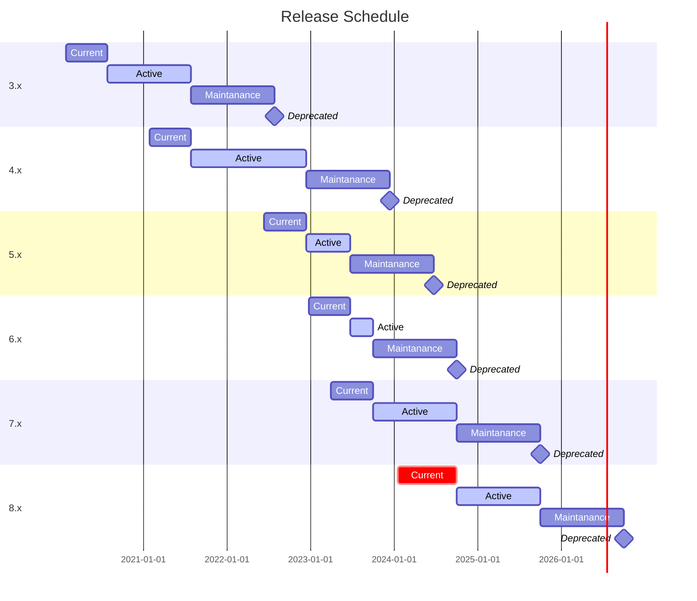

# Release schedule

Current — latest major version. Usually lives for about 6 months, and then becomes Active.

Active — Long-term Support major version which is recommended to have on all projects in the testing pipeline. Active usually lives for about a year, but exceptions are possible. Active will be renewed if necessary to properly test the next Current in order to switch Active to it.

Maintanance — a period of at least one year when the major version will receive support (bug fixed, security issues fixes, etc). After the Maintanance period expires, the version will be declared Deprecated and will no longer be supported. Maintanance begins when the next major moves into Active.

