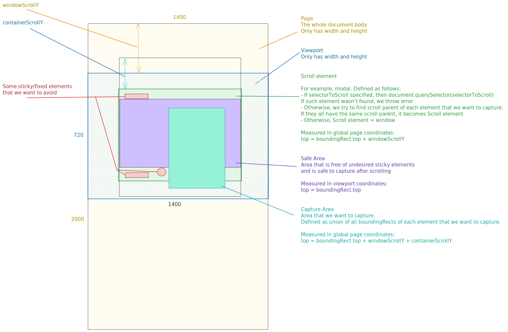

# Screenshots capturing in Testplane: Developer's perspective

> [!NOTE]
> This document is for Testplane developers. If you are looking for a user's guide, see [Visual Testing Guide](https://testplane.io/docs/v8/visual-testing/visual-testing-intro/) in our docs.

### Terminology

### Algorithm overview

Overall, we have two stages: coordinates computation and screenshot capturing itself.

Here's what happens during coordinates computation:

1. Scroll to elementToScroll (if it's not window and if it's not in view).

2. Scroll to topmost element that we want to capture inside elementToScroll.

3. Compute capture area — 1 rectangle that covers elements that we want to capture, taking into account things like box shadows, outlines and pseudo elements.

4. Compute safe area — an area that's free of potentially interfering sticky/fixed/absolute elements that may produce unwanted artifacts when scrolling.

5. Compute ignore elements areas — for each element that we want ignore, produce 1 rectangle that covers that element and takes box shadows, outlines, etc. into account.

5. Return result — an object that has everything that's needed: capture area coordinates, window/container scroll offsets, pixelRatio, safeArea coordinates, ignoreElements coordinates.

Then we can start capturing actual screenshot:

1. Capture current viewport screenshot.

2. Crop it to cover capture area or its part, taking safeArea into account. If safe area prevents us from capturing capture area, we expand crop area, ignoring safe area.

3. Save this image chunk internally in memory.

4. Scroll by safeArea size and repeat 1-4 until the whole capture area is captured. If at any point we can't scroll further, stop. If allowViewportOverflow is false, print a warning.

5. Join all image chunk and let this be a resulting screenshot.

### Notes

In some browsers, namely Chrome, it's possible to capture the whole element without scrolling, with a single method call. However, we are looking for a universal, cross-browser solution, so we can't rely on those methods alone. We could use them in supported browsers, but we haven't done so yet.
