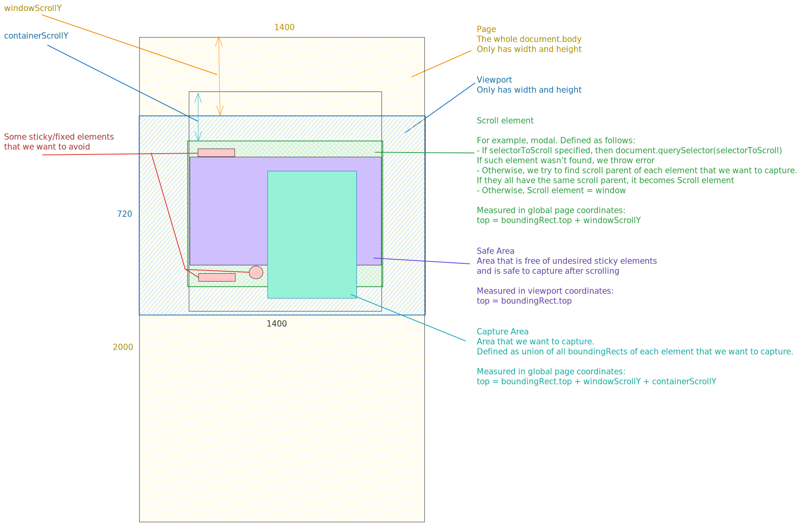

# Screenshots capturing in Testplane: Developer's perspective

> [!NOTE]
> This document is for Testplane developers. If you are looking for a user's guide, see [Visual Testing Guide](https://testplane.io/docs/v8/visual-testing/visual-testing-intro/) in our docs.

### Terminology

### Debugging

Screenshots logic is heavily covered by debug logs. Basic assertView and perf logs can be enabled by setting `DEBUG` environment variable to `testplane:screenshots*`, various namespaces are available.

Verbose compositing logs and prepare/getCaptureState browser-side geometry logs require `TESTPLANE_DEBUG_SCREENSHOTS` in addition to `DEBUG`. This environment variable also saves viewport images with debug rectangles to a directory (the directory will be created and logged to console).

### Algorithm overview

For element screenshots, we have two stages: coordinates computation and screenshot capturing itself.

Here's what happens during coordinates computation:

1. Save current scroll positions so they can be restored after capture.

2. Detect the scroll element from `selectorToScroll` or from common scroll parents of captured elements.

3. Scroll to the topmost element that we want to capture inside the scroll element, if it does not have enough safe visibility.

4. Compute capture specs for every selector that we want to capture. Each spec has full, clipped and visible rectangles, taking into account things like box shadows, outlines and pseudo elements.

5. Compute safe area — an area that's free of potentially interfering sticky/fixed/absolute elements that may produce unwanted artifacts when scrolling.

6. Compute ignore elements areas — for each element that we want ignore, produce 1 rectangle that covers that element and takes box shadows, outlines, etc. into account.

7. Return result — an object that has everything that's needed: capture specs, scroll offset, pixelRatio, safeArea coordinates, ignoreElements coordinates and viewport data.

Then we can start capturing actual screenshot:

1. Capture current viewport screenshot.

2. Register it as an in-memory composite chunk, together with current capture specs, safe area, ignore areas and anchor data.

3. Recompute capture specs and safe area after every scroll, because sticky elements, lazy loading and layout shifts can change them.

4. Scroll by the useful remaining capture height, usually close to safeArea size, and repeat 1-3 until the moving capture area is captured. If at any point we can't scroll further, stop. If allowViewportOverflow is false, print a warning.

5. Anchor all chunks in capture-area coordinates, choose safe vertical bands, fill missing gaps with black pieces and join the cropped pieces into the resulting screenshot.

### Notes

Viewport and full-page screenshots use the same camera and compositing building blocks, but skip selector-specific capture specs.

In some browsers, namely Chrome, it's possible to capture the whole element without scrolling, with a single method call. However, it still doesn't produce clean looking screenshots in many cases, e.g. long content inside modals. Besides, we are looking for a universal, cross-browser solution, so we can't rely on those methods alone. We could use those techniques in supported browsers, but we haven't done so yet.
